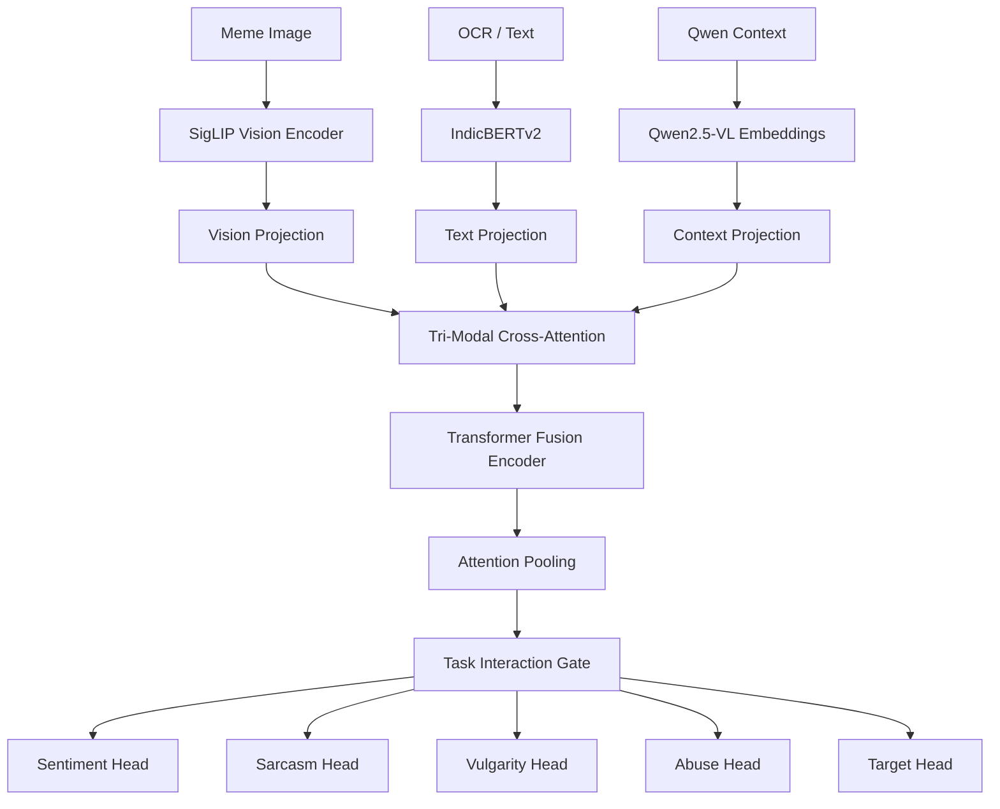

# Multi-Modal Hate Speech & Sarcasm Detection (HASOC)

A PyTorch implementation of a multi-modal, multi-task deep learning model for hate speech, sarcasm, vulgarity, abuse, and target classification in code-mixed Dravidian languages (Tamil and Telugu).

## Overview

This repository contains the pipeline for multi-class classification on the HASOC dataset using image, text, and visual-language context modalities:

- **Vision Backbone**: SigLIP (`google/siglip-base-patch16-224`)
- **Text Backbone**: IndicBERTv2 (`ai4bharat/IndicBERTv2-MLM-only`)
- **VLM Context**: Qwen2.5-VL (`Qwen/Qwen2.5-VL-3B-Instruct`) cached feature embeddings
- **Fusion**: Tri-Modal Cross-Attention block with a 2-layer Transformer Encoder
- **Multi-Task Heads**: Gated routing for 5 sub-tasks: `sentiment`, `sarcasm`, `vulgarity`, `abuse`, and `target`

## Model Architecture



## Directory Structure

```text
multiClassHateSpeech/
├── final_multimodal_hasoc_architecture_(1).ipynb   # Main Jupyter notebook containing training & eval pipeline
├── dataset/                                         # Train, validation, and test CSV files + raw images
│   ├── raw/
│   │   ├── Tamil_HASOC/images_all/
│   │   └── Telugu_HASOC/images_all/
│   ├── tamil_train.csv
│   ├── tamil_val.csv
│   ├── tamil_test_full_paddleocr.csv
│   ├── telugu_train.csv
│   ├── telugu_val.csv
│   └── telugu_test_full_paddleocr.csv
├── cache/                                           # Pre-extracted Qwen feature tensors (.pt)
│   ├── tamil/qwen_features/
│   └── telugu/qwen_features/
├── reports/                                         # Generated dataset EDA reports
├── outputs/                                         # Checkpoints, predictions, and validation dashboard
└── README.md
```

## Requirements & Setup

### Environment Prerequisites
- Python 3.8+
- PyTorch 2.0+ (CUDA GPU required)

### Dependencies
```bash
pip install torch torchvision torchaudio --index-url https://download.pytorch.org/whl/cu118
pip install transformers datasets accelerate pandas numpy scikit-learn pillow tqdm
```

## Usage

1. Open `final_multimodal_hasoc_architecture_(1).ipynb` in Jupyter Notebook, VS Code, or Google Colab.
2. Ensure dataset files and pre-extracted Qwen features are placed in `dataset/` and `cache/` respectively.
3. Run the notebook sequentially:
   - **Data Validation**: Runs exploratory data analysis and audits missing/corrupt files.
   - **Training Protocol**: Executes two-stage fine-tuning (frozen backbone warm-up followed by differential learning rate training).
   - **Evaluation**: Computes task-specific optimal F1 thresholds and exports classification metrics.
   - **Dashboard & Inference**: Builds `outputs/validation_dashboard.html` and generates test predictions for submission.

## Configuration Summary

Default hyperparameters used in `CONFIG`:

| Parameter | Value | Description |
|---|---|---|
| `d_fusion` | `256` | Hidden dimension of multi-modal fusion space |
| `batch_size` | `8` | Training batch size |
| `grad_accum_steps` | `2` | Effective batch size of 16 |
| `stage1_epochs` | `10` | Classifier head warm-up epochs |
| `stage2_epochs` | `10` | Full backbone unfreezing epochs |
| `lr_head_stage1` | `1e-4` | Learning rate for heads in Stage 1 |
| `lr_backbone_stage2` | `1e-5` | Learning rate for backbones in Stage 2 |
| `focal_gamma` | `2.0` | Gamma parameter for multi-task Focal Loss |

## License

This project is licensed under the MIT License.
